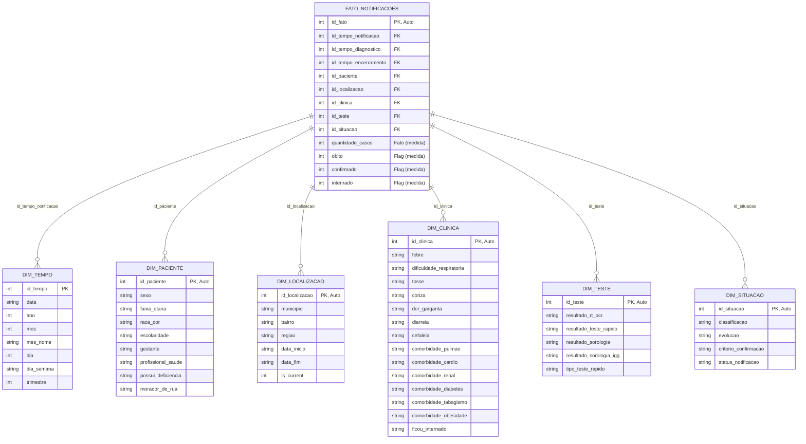

# 🏗️ Arquitetura do Data Warehouse - Modelo Dimensional

## Diagrama do Esquema Estrela



## 📊 Descrição Detalhada das Tabelas

### Tabela de Fatos: FATO_NOTIFICACOES

**Propósito**: Registro central de todas as notificações de COVID-19, conectando dimensões com medidas quantitativas.

| Campo | Tipo | Descrição |
|-------|------|-----------|
| `id_fato` | INTEGER | Chave primária (auto-increment) |
| `id_tempo_notificacao` | INTEGER | FK → DIM_TEMPO (data da notificação) |
| `id_tempo_diagnostico` | INTEGER | FK → DIM_TEMPO (data do diagnóstico) |
| `id_tempo_encerramento` | INTEGER | FK → DIM_TEMPO (data de encerramento) |
| `id_paciente` | INTEGER | FK → DIM_PACIENTE |
| `id_localizacao` | INTEGER | FK → DIM_LOCALIZACAO |
| `id_clinica` | INTEGER | FK → DIM_CLINICA |
| `id_teste` | INTEGER | FK → DIM_TESTE |
| `id_situacao` | INTEGER | FK → DIM_SITUACAO |
| `quantidade_casos` | INTEGER | **Medida**: Número de casos (geralmente 1) |
| `obito` | INTEGER | **Medida**: Flag binária (0/1) |
| `confirmado` | INTEGER | **Medida**: Flag binária (0/1) |
| `internado` | INTEGER | **Medida**: Flag binária (0/1) |

**Granularidade**: Uma linha por notificação/caso

---

### Dimensão: DIM_TEMPO

**Propósito**: Hierarquia temporal para análises por período.

| Campo | Tipo | Descrição |
|-------|------|-----------|
| `id_tempo` | INTEGER | Chave primária (YYYYMMDD format) |
| `data` | TEXT | Data no formato YYYY-MM-DD |
| `ano` | INTEGER | Ano (2020-2026) |
| `mes` | INTEGER | Mês (1-12) |
| `mes_nome` | TEXT | Nome do mês em português |
| `dia` | INTEGER | Dia do mês (1-31) |
| `dia_semana` | TEXT | Dia da semana em português |
| `trimestre` | INTEGER | Trimestre (1-4) |

**Registros especiais**: `id_tempo = -1` para datas não informadas

---

### Dimensão: DIM_PACIENTE

**Propósito**: Características demográficas e de risco do paciente.

| Campo | Tipo | Descrição |
|-------|------|-----------|
| `id_paciente` | INTEGER | Chave primária (auto-increment) |
| `sexo` | TEXT | Masculino / Feminino / Não Informado |
| `faixa_etaria` | TEXT | Grupos etários (0-19, 20-39, 40-59, 60+, etc) |
| `raca_cor` | TEXT | Classificação de raça/cor |
| `escolaridade` | TEXT | Nível de escolaridade |
| `gestante` | TEXT | Sim / Não / Não se aplica |
| `profissional_saude` | TEXT | Sim / Não |
| `possui_deficiencia` | TEXT | Sim / Não |
| `morador_de_rua` | TEXT | Sim / Não |

**Constraint**: UNIQUE sobre todas as colunas (evita duplicatas)

---

### Dimensão: DIM_LOCALIZACAO

**Propósito**: Localização geográfica do paciente com histórico de mudanças.

| Campo | Tipo | Descrição |
|-------|------|-----------|
| `id_localizacao` | INTEGER | Chave primária (auto-increment) |
| `municipio` | TEXT | Município de residência |
| `bairro` | TEXT | Bairro |
| `regiao` | TEXT | Região geográfica (inferida) |
| `data_inicio` | TEXT | Data de início da localização |
| `data_fim` | TEXT | Data de término (NULL se atual) |
| `is_current` | INTEGER | Flag (1 = registro atual, 0 = histórico) |

**Padrão**: SCD Type 2 (Slowly Changing Dimension)

---

### Dimensão: DIM_CLINICA

**Propósito**: Sintomas e comorbidades clínicas.

| Campo | Tipo | Descrição |
|-------|------|-----------|
| `id_clinica` | INTEGER | Chave primária (auto-increment) |
| `febre` | TEXT | Presença de febre (Sim/Não) |
| `dificuldade_respiratoria` | TEXT | Dificuldade para respirar |
| `tosse` | TEXT | Presença de tosse |
| `coriza` | TEXT | Coriza/nariz entupido |
| `dor_garganta` | TEXT | Dor de garganta |
| `diarreia` | TEXT | Diarreia |
| `cefaleia` | TEXT | Dor de cabeça |
| `comorbidade_pulmao` | TEXT | Doença pulmonar crônica |
| `comorbidade_cardio` | TEXT | Doença cardíaca |
| `comorbidade_renal` | TEXT | Doença renal |
| `comorbidade_diabetes` | TEXT | Diabetes |
| `comorbidade_tabagismo` | TEXT | Histórico de tabagismo |
| `comorbidade_obesidade` | TEXT | Obesidade |
| `ficou_internado` | TEXT | Necessidade de internação |

**Constraint**: UNIQUE sobre todas as colunas

---

### Dimensão: DIM_TESTE

**Propósito**: Resultados de diferentes tipos de testes COVID-19.

| Campo | Tipo | Descrição |
|-------|------|-----------|
| `id_teste` | INTEGER | Chave primária (auto-increment) |
| `resultado_rt_pcr` | TEXT | Resultado RT-PCR (Positivo/Negativo/Indeterminado) |
| `resultado_teste_rapido` | TEXT | Resultado teste rápido |
| `resultado_sorologia` | TEXT | Resultado sorologia (anticorpos) |
| `resultado_sorologia_igg` | TEXT | Resultado específico IgG |
| `tipo_teste_rapido` | TEXT | Tipo de teste rápido utilizado |

**Constraint**: UNIQUE sobre todas as colunas

---

### Dimensão: DIM_SITUACAO

**Propósito**: Status e classificação da notificação.

| Campo | Tipo | Descrição |
|-------|------|-----------|
| `id_situacao` | INTEGER | Chave primária (auto-increment) |
| `classificacao` | TEXT | Confirmado / Descartado / Suspeito |
| `evolucao` | TEXT | Cura / Óbito / Internação / etc |
| `criterio_confirmacao` | TEXT | Critério usado para confirmar |
| `status_notificacao` | TEXT | Ativo / Encerrado / etc |

**Constraint**: UNIQUE sobre todas as colunas

---

## 🔄 Fluxo de Dados

```
MICRODADOS.csv (Origem)
         ↓
    [ETL Pipeline]
    - Limpeza
    - Normalização
    - Deduplicação
         ↓
  [DW SQLite]
    - DIM_TEMPO
    - DIM_PACIENTE
    - DIM_LOCALIZACAO
    - DIM_CLINICA
    - DIM_TESTE
    - DIM_SITUACAO
    - FATO_NOTIFICACOES
         ↓
  [Dashboard Streamlit]
    - Filtros
    - Gráficos
    - Métricas
```

## 🎯 Vantagens do Esquema Estrela

✅ **Simplicidade**: Estrutura intuitiva com fatos no centro e dimensões ao redor
✅ **Desempenho**: Joins eficientes com poucas tabelas
✅ **Reusabilidade**: Dimensões compartilhadas entre múltiplos fatos
✅ **Escalabilidade**: Fácil adicionar novas dimensões ou medidas
✅ **Análises**: Suporta slicing, dicing, drill-down e agregações

## 📈 Exemplos de Análises Possíveis

- Casos por município, bairro e data
- Taxas de mortalidade por faixa etária e sexo
- Evolução temporal de sintomas e comorbidades
- Comparação de eficácia de testes
- Distribuição de internações por período
- Análise de pacientes com múltiplas comorbidades

---

**Criado para o projeto COVID DW | 2026**
